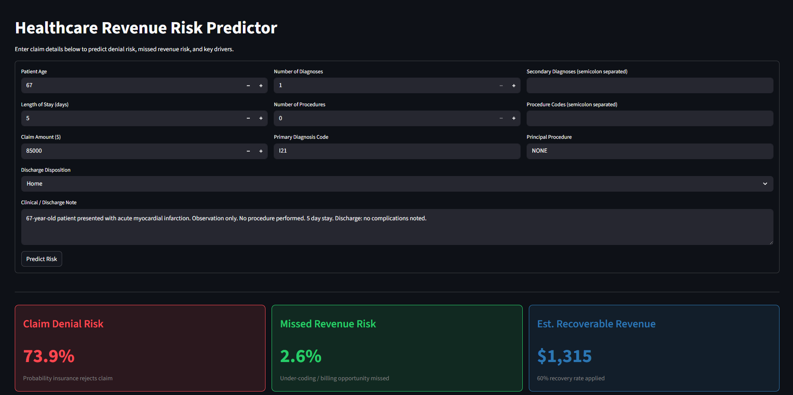

# Healthcare Revenue Risk Predictor

A **PyTorch-based clinical AI system** that predicts hospital claim denial risk and missed billing opportunity using **structured claim features** and **clinical free-text**. Built in the style of hospital revenue-cycle AI

---

## What It Does

| Input | Output |
|-------|--------|
| Patient age, diagnosis codes (ICD), procedure codes (CPT), length of stay, claim amount | **Claim denial risk** (0-100%) |
| Discharge notes / clinical free-text | **Missed revenue risk** (0-100%) |
| | **Explanation** of key drivers |
| | **Estimated recoverable revenue** |

---

## Architecture

```
Healthcare Claims Data
    |
    v
SQL / Pandas Preprocessing
    |
    v
Structured Features + Clinical Text
    |
    v
PyTorch Multi-Task Model
    |-- Structured MLP Encoder
    |-- BiGRU + Attention Text Encoder
    |
    v
Risk Scores + Explainability
    |
    +---> FastAPI Endpoint (/predict-denial-risk)
    +---> Streamlit Prediction UI (single claim)
    +---> Streamlit KPI Dashboard (aggregate analytics)
```

---

## Tech Stack

- **Python** | **PyTorch** — deep learning model
- **Pandas / scikit-learn** — feature engineering, preprocessing
- **FastAPI** — production inference API
- **Streamlit** — interactive UIs
- **SQLite-style CSV** — simulated data warehouse

---

## Quick Start

### 1. Install Dependencies

```bash
pip install -r requirements.txt
```

### 2. Generate Synthetic Data

```bash
python data/generate_data.py
```

Creates `data/claims.csv` with 2,000 synthetic hospital claims.

### 3. Preprocess

```bash
python data/preprocess.py
```

- Feature engineering (`cost_per_day`, `high_cost_flag`, etc.)
- Vocabulary building from clinical text
- Train / val / test split

### 4. Train Model

```bash
python models/train.py
```

- Saved to `models/revenue_risk_model.pt`
- Typical results: **Denial AUC ~0.90**, **Missed Revenue AUC ~0.89**

---

## Running the Application

### Option A: FastAPI Endpoint

```bash
uvicorn api.main:app --reload
```

- Health check: `GET http://localhost:8000/health`
- Predict: `POST http://localhost:8000/predict-denial-risk`

**Example request:**

```bash
curl -s -X POST http://127.0.0.1:8000/predict-denial-risk \
  -H "Content-Type: application/json" \
  -d '{
    "patient_age": 67,
    "length_of_stay": 5,
    "claim_amount": 85000,
    "num_diagnoses": 1,
    "num_procedures": 0,
    "primary_diagnosis": "I21",
    "discharge_disposition": "Home",
    "note_text": "67-year-old patient presented with acute myocardial infarction. Observation only."
  }'
```

**Example response:**

```json
{
  "claim_denial_risk": 0.7388,
  "missed_revenue_risk": 0.0258,
  "denial_explanation": [
    {"feature": "discharge_disposition=AMA", "denial_impact": 0.0008, "missed_revenue_impact": -0.0001},
    {"feature": "num_diagnoses", "denial_impact": 0.0006, "missed_revenue_impact": -0.0004}
  ],
  "text_highlights": [
    {"token": "observation", "attention_weight": 0.2997},
    {"token": "infarction", "attention_weight": 0.1197}
  ],
  "estimated_recoverable_revenue": 1315.00,
  "message": "Prediction complete. Review high-attention clinical terms and top structured risk drivers."
}
```

---

### Option B: Streamlit Prediction UI

Interactive single-claim risk checker with visual explanations.

```bash
streamlit run frontend/predict_ui.py
```

**What you see:**

| | |
|---|---|
| **Risk Score Cards** | Denial risk %, missed revenue %, recoverable $ |
| **Structured Drivers** | Top 5 features pushing prediction up/down |
| **Text Attention** | Bar chart of high-attention clinical terms |

**Screenshot:**



---

### Option C: Streamlit KPI Dashboard

Aggregate business analytics across all claims.

```bash
streamlit run dashboard/kpi_dashboard.py
```

**Metrics tracked:**
- Average denial risk per discharge disposition
- Estimated total recoverable revenue
- High-risk claim tables (top 20)

---

## Model Details

### Architecture

| Component | Description |
|-----------|-------------|
| **Structured Encoder** | MLP (input -> 128 -> 64) over tabular features |
| **Text Encoder** | Embedding (2000 vocab) -> BiGRU (64 hid) -> Attention Pool -> 64-dim |
| **Fusion** | Concatenate structured + text vectors -> MLP (64) |
| **Output Heads** | Sigmoid classifier for denial; Sigmoid classifier for missed revenue |

### Explainability

- **Text:** Attention weights over clinical tokens (which words matter?)
- **Structured:** Per-feature perturbation-based importance (how does changing age/LOS/amount affect risk?)

---

## Project Structure

```
healthcare-revenue-risk-predictor/
|
|-- data/
|   |-- generate_data.py        # Synthetic patient claims generator
|   |-- preprocess.py            # Feature engineering / SQL-style transforms
|   |-- claims.csv               # Generated data (gitignored)
|   |-- processed/               # Train/val/test tensors (gitignored)
|
|-- models/
|   |-- model.py                 # PyTorch multi-task architecture
|   |-- train.py                 # Training loop with early stopping
|   |-- revenue_risk_model.pt  # Trained weights (gitignored)
|
|-- api/
|   |-- main.py                  # FastAPI app
|   |-- schemas.py               # Pydantic request/response models
|
|-- frontend/
|   |-- predict_ui.py            # Streamlit single-claim interactive UI
|
|-- dashboard/
|   |-- kpi_dashboard.py         # Streamlit aggregate KPI dashboard
|
|-- utils/
|   |-- explainability.py        # Attention highlights + feature importance
|
|-- requirements.txt
|-- .gitignore
|-- README.md
```

---

## Business Logic Behind the Model

The synthetic data generator creates realistic risk signals. The model learns to pick up on patterns like:

| High Denial Risk Signal | High Missed Revenue Risk Signal |
|---|---|
| High claim amount + no procedures | Few diagnosis codes + long stay |
| Long stay + low procedural complexity | No principal procedure coded |
| AMA discharge | Missing secondary diagnoses |
| High cost per day | Clinical note mentions complications but coding doesn't reflect them |

---

## Why This Fits the SmarterDx Profile

- **Hospital revenue cycle** domain
- **Structured + unstructured (text)** data fusion
- **PyTorch** deep learning
- **Explainable AI** — clinical and business interpretability
- **Business KPIs** — recoverable revenue estimation
- **FastAPI** deployable endpoint
- **Simulated data warehouse** pipeline (Snowflake-style)

---

## License

MIT
